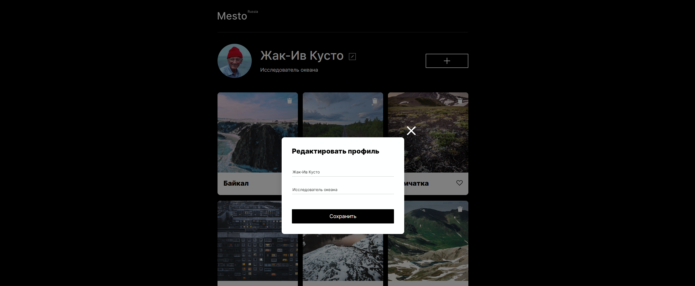

# **Проект: Место**
 
[Сервис](https://sergeshchelokov.github.io/mesto/) представляет собой интерактивную страницу, куда можно добавлять фотографии, удалять их и ставить лайки  

## `Стек технологий`:

- HTML5;
- CSS3:
- Flexbox;
- Grid Layout;
- Positioning;
- Adaptive UI;
- Media Queries;
- Методология БЭМ;
- Файловая структура Nested БЭМ;
- JavaScript

### `Функционал:`
- Блок где можо указать имя и род деятельности;  
- Кнопка для добавление новых фотографий;  
- Добавить карточку-фотографию с картинкой;
- Кнопка "лайк" позволяет отмечать понравившиеся места;
